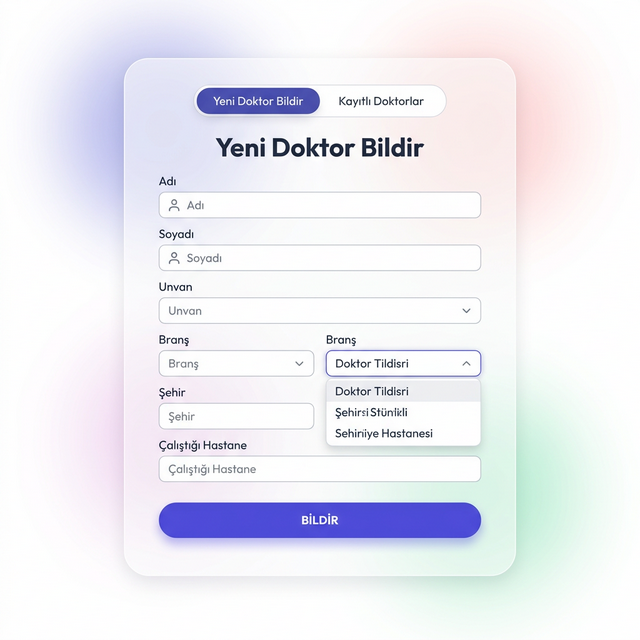
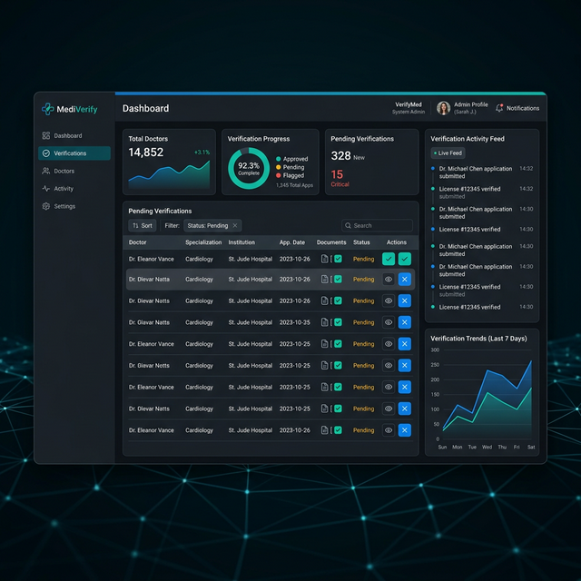

# Doktor Doğrulama Sistemi 

Türkiye'deki doktor bilgilerini (ad, soyad, unvan, branş, şehir, çalıştığı hastane) **10 farklı sağlık platformundan** otomatik olarak tarayan, çapraz doğrulama yapan ve güvenilirlik puanı hesaplayan bir web uygulamasıdır.

## 🎯 Proje Amacı

Kullanıcılar tarafından girilen sahte veya yetkisiz doktor profillerini tespit etmek amacıyla geliştirilmiş bir doğrulama sistemidir. Kullanıcılar bir doktorun bilgilerini sisteme girer; sistem bu bilgileri birden fazla kaynakta arayarak doğrular ve bir güvenilirlik skoru üretir.

## ✨ Özellikler

- **Çoklu Kaynak Tarama** — 10 farklı sağlık sitesinden eş zamanlı veri çekme
- **Akıllı Puanlama Algoritması** — İsim, unvan, branş ve hastane bilgilerini karşılaştırarak güvenilirlik skoru hesaplama
- **Admin Paneli** — Doktor onaylama, reddetme, düzenleme ve hastane yönetimi
- **Güvenli Kimlik Doğrulama** — BCrypt ile şifrelenmiş oturum yönetimi
- **Şehir Bazlı Filtreleme** — Doktorları ve hastaneleri şehre göre filtreleme

## 🛠️ Teknolojiler

| Katman | Teknoloji |
|--------|-----------|
| Backend | Python, Flask |
| Veritabanı | SQLite |
| Frontend | HTML, CSS, JavaScript |
| Web Scraping | BeautifulSoup4, Requests |
| Güvenlik | Flask-Bcrypt, Session Auth |

## 📁 Proje Yapısı

```
├── app.py              # Ana Flask sunucusu ve API endpoint'leri
├── config.py           # Yapılandırma sabitleri
├── core/
│   ├── database.py     # Veritabanı bağlantı yönetimi
│   ├── scoring.py      # Doktor güvenilirlik puanlama algoritması
│   └── utils.py        # Yardımcı fonksiyonlar
├── scrapers/
│   ├── base.py         # Tüm scraper'ların türediği temel sınıf
│   └── *.py            # 10 farklı site için scraper modülleri
├── templates/          # HTML şablonları (Kullanıcı & Admin arayüzü)
└── static/             # CSS dosyaları
```

## 🚀 Kurulum

```bash
# 1. Repoyu klonlayın
git clone https://github.com/KULLANICIADI/doktor-dogrulama-sistemi.git
cd doktor-dogrulama-sistemi

# 2. Sanal ortam oluşturun
python -m venv .venv
.venv\Scripts\activate  # Windows

# 3. Bağımlılıkları yükleyin
pip install -r requirements.txt

# 4. Ortam değişkenlerini ayarlayın
# .env.example dosyasını .env olarak kopyalayıp kendi değerlerinizi girin
copy .env.example .env

# 5. Uygulamayı başlatın
python app.py
```

Uygulama varsayılan olarak `http://localhost:5000` adresinde çalışır.

## 📸 Ekran Görüntüleri

Sistemin tasarım dilini ve işlevselliğini yansıtan örnek arayüz taslakları:

### Kullanıcı Formu


### Yönetim Paneli


> [!NOTE]
> Yukarıdaki görseller temsilidir ve uygulamanın tasarım standartlarını yansıtmak amacıyla hazırlanmıştır.

## 📄 Lisans

Bu proje [MIT Lisansı](LICENSE) ile lisanslanmıştır.

## 👤 Geliştirici

**Muhammet Algan**
- GitHub: [@Muhammet-Algan](https://github.com/Muhammet-Algan)
